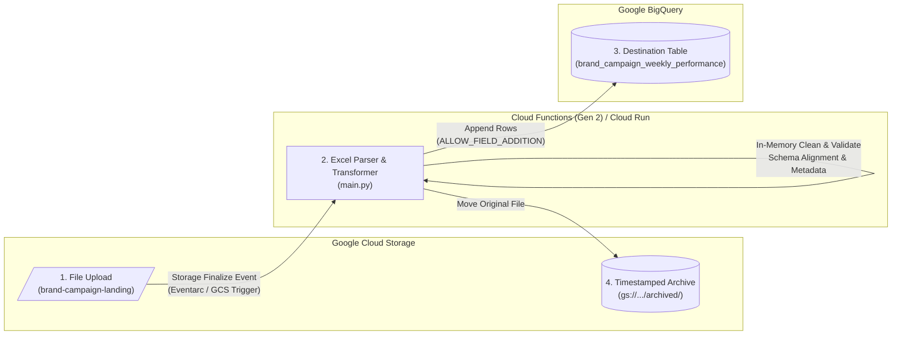

# Serverless GCS Excel to BigQuery Ingestion Pipeline

[](https://cloud.google.com/)
[](https://www.python.org/)
[](https://pandas.pydata.org/)
[](LICENSE)

An event-driven, serverless data pipeline that automatically ingests, cleanses, standardizes, and loads Excel spreadsheets (`.xlsx`, `.xls`) from **Google Cloud Storage (GCS)** into **Google BigQuery**. 

Designed for automated reporting and marketing operations with **zero infrastructure management**, **dynamic schema evolution**, and **automatic file archiving**.

---

## 📌 Architecture Overview



### End-to-End Workflow:
1. **File Upload**: Users, automated scripts, or email ingestion services drop an Excel file (`.xlsx` or `.xls`) into the GCS landing bucket root.
2. **Event Trigger**: Cloud Storage emits a `google.cloud.storage.object.v1.finalized` event to trigger the Cloud Function (Gen 2).
3. **In-Memory Transformation**: The function reads the spreadsheet directly into memory (`io.BytesIO`), sanitizes headers, standardizes dates, injects lineage metadata, and matches types against existing BigQuery columns.
4. **BigQuery Load**: Records are appended directly to the BigQuery table using high-speed load jobs with automatic schema expansion.
5. **Automated Archival**: The processed file is moved to `gs://<bucket>/archived/<YYYYMMDD_HHMMSS>_<filename>` to maintain an immutable audit trail and prevent duplicate processing.

---

## 🚀 Key Features & Guardrails

* **⚡ Purely Serverless & Cost-Effective**: Request-based autoscaling (0 to N instances). Incurs **zero idle compute costs**.
* **🛡️ Infinite Loop & Duplicate Safeguards**: Automatically ignores events from the `archived/` directory and non-spreadsheet file formats. Safely handles retried events on already-moved files.
* **🧹 Smart Column Sanitization**:
  * Converts headers to clean `snake_case`.
  * Regex-strips special characters, symbols (`$`, `%`, `@`), parentheses, hyphens, and spaces (e.g., `Cost (CAD)` $\rightarrow$ `cost_cad`, `CTR %` $\rightarrow$ `ctr`).
  * Prefixes leading numbers with an underscore (`_`) for BigQuery identifier compliance.
* **📅 Date Normalization**: Automatically identifies `date` and `period` columns and formats values into ISO standard `YYYY-MM-DD`.
* **🔍 Dynamic Schema Alignment**:
  * Inspects existing BigQuery table types before inserting.
  * Formats string columns cleanly (prevents trailing `.0` on integer-like floats such as postal codes or IDs).
  * Coerces numeric, float, and integer types to eliminate `ArrowTypeError` runtime failures.
* **📈 Automatic Schema Evolution**: Configured with `ALLOW_FIELD_ADDITION`, allowing new columns introduced by upstream marketing vendors to be automatically added to BigQuery without pipeline downtime.
* **🕵️ Built-in Data Lineage**: Injects audit columns (`_ingested_at` UTC timestamp and `_source_file` name) onto every row.

---

## 📁 Repository Structure

```
.
├── cloud_function/
│   ├── main.py                     # Core Cloud Function logic & transformation pipeline
│   └── requirements.txt            # Python dependencies (Functions Framework, Pandas, OpenPyXL, etc.)
├── gcs_excel_to_bigquery_guide.md  # Comprehensive deployment & architecture walkthrough
└── README.md                       # Repository documentation
```

---

## ⚙️ Configuration & Environment Variables

| Variable | Default Value | Description |
| :--- | :--- | :--- |
| `BIGQUERY_DATASET` | `IntactLoadTesting` | Target BigQuery dataset ID |
| `BIGQUERY_TABLE` | `brand_campaign_weekly_performance` | Target BigQuery table name |

---

## 🛠️ Step-by-Step Deployment Guide

### Option A: Deploy via GCP Console (No CLI Required)

#### 1. Create the Cloud Storage Bucket
1. Go to **Cloud Storage** > **Buckets** in the GCP Console.
2. Click **+ CREATE**.
3. Name: `brand-campaign-landing` (or your chosen bucket name).
4. Location: Select your preferred region (e.g., `northamerica-northeast1 (Montréal)`).
5. Storage Class: **Standard**. Click **CREATE**.

#### 2. Create the BigQuery Dataset
1. Navigate to **BigQuery** in the GCP Console.
2. In the Explorer panel, click the three dots next to your Project ID > **Create dataset**.
3. Set **Dataset ID**: `IntactLoadTesting`.
4. Set **Data location**: Same region as your bucket (e.g., `northamerica-northeast1`).
5. Click **CREATE DATASET**. *(The table will be auto-created upon the first file upload).*

#### 3. Deploy the Cloud Function (Gen 2) / Cloud Run Function
1. Navigate to **Cloud Run** or **Cloud Functions** and click **Create service** / **Write a function**.
2. Select the **Python** environment.
3. Configure the following settings:
   - **Service Name**: `excel-to-bigquery-loader`
   - **Region**: `northamerica-northeast1` (match bucket and dataset region)
   - **Runtime**: `Python 3.11` or `Python 3.12`
   - **Trigger**: Click **+ Add Trigger** > Select **Cloud Storage**:
     - **Event**: `google.cloud.storage.object.v1.finalized`
     - **Bucket**: `brand-campaign-landing`
   - **Scaling**: Minimum instances = `0`, Maximum instances = `10`
   - **Environment Variables**: Add `BIGQUERY_DATASET` and `BIGQUERY_TABLE` if custom values are needed.
4. Click **CREATE** / **NEXT** to open the Code Editor:
   - **Entry point**: `gcs_excel_to_bigquery` (or `hello_gcs`)
   - Copy contents of [cloud_function/requirements.txt](file:///home/mmds/intact_marketing/cloud_function/requirements.txt) into `requirements.txt`.
   - Copy contents of [cloud_function/main.py](file:///home/mmds/intact_marketing/cloud_function/main.py) into `main.py`.
5. Click **DEPLOY**.

---

### Option B: Deploy via Google Cloud CLI (`gcloud`)

```bash
# Set environment variables
export PROJECT_ID="your-gcp-project-id"
export REGION="northamerica-northeast1"
export BUCKET_NAME="brand-campaign-landing"
export DATASET_NAME="IntactLoadTesting"
export TABLE_NAME="brand_campaign_weekly_performance"

# 1. Create Cloud Storage Bucket
gcloud storage buckets create gs://${BUCKET_NAME} \
    --project=${PROJECT_ID} \
    --location=${REGION}

# 2. Create BigQuery Dataset
bq --location=${REGION} mk \
    --dataset \
    --description "Marketing and Campaign Ingestion Dataset" \
    ${PROJECT_ID}:${DATASET_NAME}

# 3. Deploy Cloud Function (Gen 2)
cd cloud_function
gcloud functions deploy excel-to-bigquery-loader \
    --gen2 \
    --runtime=python311 \
    --region=${REGION} \
    --source=. \
    --entry-point=gcs_excel_to_bigquery \
    --trigger-event-filters="type=google.cloud.storage.object.v1.finalized" \
    --trigger-event-filters="bucket=${BUCKET_NAME}" \
    --set-env-vars BIGQUERY_DATASET=${DATASET_NAME},BIGQUERY_TABLE=${TABLE_NAME} \
    --memory=1GiB \
    --timeout=300s
```

---

## 🔍 Deep Dive: Transformation Logic (`main.py`)

| Stage | Process | Action Taken |
| :--- | :--- | :--- |
| **Stage 1** | **Event Filtering** | Skips `archived/` prefix and non-`.xlsx`/`.xls` files. Safely handles dead events with `blob.exists()` and `NotFound` checks. |
| **Stage 2** | **In-Memory Read** | Streams file via `io.BytesIO` directly into `pandas.read_excel(..., engine='openpyxl')`. Avoids local disk I/O. |
| **Stage 3** | **Column Sanitization** | Lowercases headers, strips symbols via regex (`r"[^a-z0-9_]+"`), trims underscores, prefixes digits with `_`. |
| **Stage 4** | **Lineage & Dates** | Injects `_ingested_at` (UTC timestamp) and `_source_file`. Coerces date/period columns to `%Y-%m-%d`. |
| **Stage 5** | **Schema Alignment** | Matches DataFrame types against existing BigQuery schema: converts strings cleanly, parses numerics/integers safely. |
| **Stage 6** | **BigQuery Ingestion** | Executes `load_table_from_dataframe` with `WRITE_APPEND` and `ALLOW_FIELD_ADDITION`. |
| **Stage 7** | **Auto-Archiving** | Copies file to `archived/<YYYYMMDD_HHMMSS>_<filename>` and deletes the raw landing blob. |

---

## 🧪 Testing & Verification

1. **Upload a Sample Spreadsheet**:
   Drop an Excel report into the landing bucket:
   ```bash
   gcloud storage cp weekly_campaign_report.xlsx gs://brand-campaign-landing/
   ```

2. **Monitor Function Execution Logs**:
   ```bash
   gcloud functions logs read excel-to-bigquery-loader --gen2 --region=northamerica-northeast1 --limit=50
   ```

3. **Verify BigQuery Ingestion**:
   ```sql
   SELECT 
     _source_file,
     _ingested_at,
     COUNT(*) AS records_loaded
   FROM `IntactLoadTesting.brand_campaign_weekly_performance`
   GROUP BY _source_file, _ingested_at
   ORDER BY _ingested_at DESC;
   ```

4. **Verify GCS Archival**:
   Confirm that the raw file was removed from root and moved into the archive directory:
   ```bash
   gcloud storage ls gs://brand-campaign-landing/archived/
   ```

---

## 📊 Data Quality & Governance (Optional)

For automated quality monitoring, this repository includes Dataplex / Knowledge Catalog Data Quality configurations ([dataplex_dq_spec.yaml](file:///home/mmds/intact_marketing/dataplex_dq_spec.yaml)):
* **Dynamic Missing Date Detection**: Ensures continuous daily/weekly reporting without missing intervals.
* **Volume Anomaly Detection**: Validates ingested row counts against 3 standard deviations of rolling historical averages.
* **Completeness & Null Checks**: Ensures vital campaign dimensions and metrics are populated.

---

## 📄 License

This project is licensed under the Apache 2.0 License.
